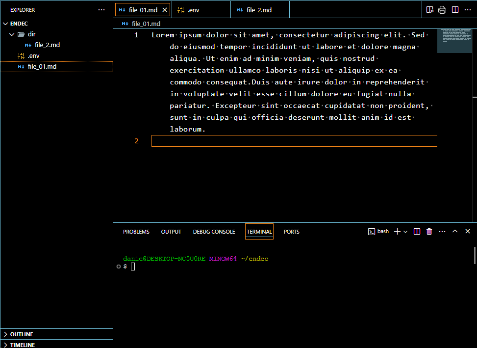

# endec

## Overview

`endec` is a simple command-line interface for encrypting and decrypting strings in markdown files.

## Installation

To install, clone the repository and install the necessary dependencies:

```sh
npm install endec-md
```

## Usage

```sh
endec [options] [encrypted-code]
```

### Arguments

- `[encrypted-code]` (optional): Encrypted code is a base64 string to be decrypted. If provided, all other options will be ignored.

### Options

- `-d, --decrypt`: Decrypt content enclosed by `<dec>` tags in all targeted files. By default, the program encrypts content enclosed by `<enc>` tags.
- `-r, --recursive`: Do a recursive search for markdown files.
- `-s, --show`: Shows the decrypted content for a period of time and then clears it. If not specified, the decrypted content will be copied to the clipboard. The display time period is 5 seconds by default, but can be changed by the `SHOW_DECRYPTED_SECONDS` environment variable.
- `-t, --target <string>`: Specify the target path, which can be a markdown file or a directory.
- `-i, --init`: initialize a git repository and create a pre-commit hook to scan for unencrypted data before committing. 
- `--dry-run`: Dry-run mode; will not write any files, just prints which files will be affected.

## How It Works

This program is designed to search exclusively for markdown files with the `.md` extension. It identifies tags in the format `<enc>content</enc>` and encrypts all content enclosed within these tags. The resulting encrypted tags will appear as follows: `**encrypted**<!--<dec>hashed(content)</dec>-->`.

### Encryption Details

The encryption process is highly secure, utilizing a 256-bit key derived from PBKDF2 with AES-256-GCM. This method incorporates a random 12-byte initialization vector (IV) and produces a Base64-encoded output, ensuring robust encryption of your data.
The passkey for encryption and decryption can be read from the environment variable PASSKEY. If this variable is not set, you will be prompted to enter the passkey.

### Default Ignored Directories

By default, this command-line tool will ignore `README.md`, `node_modules`, `.vscode`, `.sample` and `.git` to ensure optimal performance and avoid unnecessary processing.

### Excluding Files and Directories

For excluding specific files and directories from processing, create a file named `.endecignore` and list the items to be ignored.

### Multi-Line Content

For multi-line content, use the `<enc></enc>` tags to enclose the text you wish to encrypt.

## Notes

- Nested tags are not supported.
- Multiple lines can be enclosed by `<enc>` and `</enc>`.
- Do **NOT** forget your passkey and ensure it is **NOT** exposed to others.
- It is adviced to firct run `endec --init`  in an empty directory to initialize a git repository with a pre-commit hook to prevent commiting unencrypted files. Then one can add the remote repositories `git remote add origin [my-remote-repository-url]`

## Examples

Encrypting markdown files found in the current directory, excluding subdirectories:

```sh
endec
```

Encrypting content in a specific markdown file:

```sh
endec -t example.md
```

Decrypting content in a markdown file:

```sh
endec -d -t example.md
```

Performing a dry run:

```sh
endec --dry-run -t example.md
# or
endec --dry-run
# or recursivly
endec -r --dry-run
```

Showing decrypted content for a limited time:

```sh
endec -s [encrypted-code]
```

Searching directories recursively:

```sh
endec -r -t ./docs
```

## Animation

Below is a basic usage of `endec`


## License

This project is licensed under the MIT License.

---
